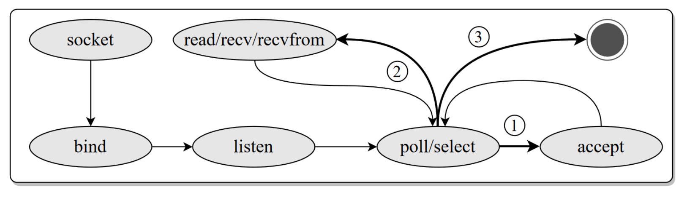

# build

The compilation process is essentially the same as gh3fuzz, with the patched qemuafl replacing the qemuafl in AFL++.

```
docker build .
```

Then replace the file in /gh3fuzz/fuzz_bins/qemu with the compiled afl-qemu-trace.

base qemuafl verison: a120c3feb573d4cade292cdeb7c1f6b1ce109efe
base AFL++ version: 4.01c

# Touched files

linux-user/syscall.c
* norandom. Hook time-related syscalls to ensure that the Cookie remains fixed.
* AFL_AUTH. Modify the state machine of the C network program so that on the first call to the recv/recvfrom function, it reads data from the environment variable (used for authentication). Only on the second recv/recvfrom trigger will it consume the test case from AFL++.
* AFL_FUZZ_IP. 
* FW_DEBUG. Print data from read and write syscalls for debugging purposes.


The network state machine for the C program can be referenced as shown in the figure below.




# Usage of new feathers

## Initializer.py 

Run this script to generate RAWCREDSDUMP, which will then be read by AFL_AUTH.

```
python3 Initializer.py  -m SINGLE_LOGIN [-b BRAND] [-t TARGETIP] [-p PORT] [-u USERNAME] [-w PASSWORD] [-r RAWCREDSDUMP]
```


## norandom
The modified afl-common.c program will automatically call norandom.

## AFL_AUTH

Optional.
Pass the HTTP authentication request data generated by Initializer.py.

Usage example: 
```
# export AFL_AUTH=$'GET /login.cgi HTTP/1.0\r\nHost: http://172.21.0.2:80\r\nUser-Agent: Mozilla/5.0 (Windows NT 10.0; Win64; x64) AppleWebKit/537.36 (KHTML, like Gecko) Chrome/56.0.2924.76 Safari/537.36\r\nAccept-Encoding: gzip, deflate\r\nAccept: */*\r\nConnection: close\r\nOrigin: http://172.21.0.2:80\r\nReferer: http://172.21.0.2:80\r\nCache-Control: max-age=0\r\nContent-Length: 117\r\nContent-Type: application/x-www-form-urlencoded\r\n\r\nhtml_response_page=login_fail.asp&login_name=YWRtaW4%3D&login_pass=&graph_id=d360e&log_pass=&graph_code=&Login=Log+In'
```

Note that "$" is mandatory, and the request should conform to the HTTP format. Each line of data in the HTTP header is separated by "\r\n", and the HTTP header is separated from the HTTP body by "\r\n\r\n".


## AFL_FUZZ_IP
Optional.
In some firmware, the fuzzing process can only start if the client's IP address matches the IP address bound to the webserver (usually the br0 or eth0 network interface).

Usage example: 
```
export AFL_FUZZ_IP="192.168.1.1"
```


## FW_DEBUG
Optional.

Usage example: 
```
export FW_DEBUG=1
```